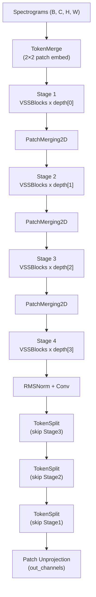

# LocalMamba Diffusion Architecture

LocalMamba adapts the hierarchical **LocalVMamba** design into a diffusion-ready denoiser that pairs selective scan state-space layers with the existing Signal Diffusion adapter interface. The goal is to keep the memory efficiency of Mamba-style recurrence while matching the U-Net-like skip topology already used by `hourglass.py`.

## High-Level Dataflow



- **TokenMerge/TokenSplit** mirror the Hourglass patch projectors so diffusion adapters can hot-swap denoisers without retraining schedules.
- Each `Stage` is a stack of `ConditionedVSSBlock` modules (VSSBlock + AdaRMSNorm).
- Skip tensors are cached before every downsample and concatenated during the matching decoder step.

## Selective Scan Blocks

1. `MultiScanVSSM` gathers local sequences using horizontal, vertical, and windowed (w7) scans, optionally flipped for bidirectionality.
2. `multi_selective_scan()` projects the scan tokens into `(Δ, B, C)` triplets and feeds them into `mamba_ssm.ops.selective_scan_fn`, which now hides the `B × groups × d_state × L` CUDA layout.
3. `BiAttn` scores each scan direction and fuses them before the residual connection.

```
[B,C,H,W] --scan--> [B,K,C,L] --proj--> Δ/B/C tensors --selective_scan_fn--> [B,K,C,L]
                  ↘ BiAttn merge ↙                                 ↓
                           reshape → [B,H,W,C]
```

## Conditioning Path

- Time/noise embedding: Fourier features + 2-layer MappingNetwork (`mapping_width`, `mapping_depth`).
- Class/caption conditioning: extra embeddings concatenated with time features and passed through the same mapping MLP.
- AdaRMSNorm shifts/scales every block via a tiny linear head tagged with `mapping` for optimizer filtering.
- CFG dropout is handled at the adapter layer, matching Hourglass behavior for classifier-free guidance.

## Files & Responsibilities

| File | Role |
|------|------|
| `signal_diffusion/diffusion/models/localmamba.py` | Adapter wiring, config parsing, registry entry |
| `signal_diffusion/diffusion/models/localmamba_model/localmamba_2d.py` | Hierarchical denoiser (TokenMerge, mapping net, VSS stages, decoder) |
| `signal_diffusion/diffusion/models/localmamba_model/vmamba_blocks.py` | VSSBlock + PatchMerging2D + MultiScanVSSM helpers |
| `signal_diffusion/diffusion/models/localmamba_model/ss2d.py` | Selective scan math and BiAttn fusion |
| `signal_diffusion/diffusion/models/localmamba_model/local_scan.py` | Triton kernels for local scan/reverse operations |
| `signal_diffusion/diffusion/models/localmamba_model/flags.py` | Feature toggles (checkpointing, compile, precision, scan directions) |

## Configuration Tips

- Start from `config/diffusion/localmamba-baseline.toml`. Tune `dims` and `depths` together so the encoder/decoder stay symmetric.
- `scan_directions` defaults to `["h", "v", "w7"]`. Add `*_flip` variants only if memory allows, as each direction increases CUDA work.
- For low-memory GPUs, enable `[training] gradient_checkpointing = true` and set `model.extras.cfg_dropout` ≥ 0.1 to help CFG training stability.
- Use `prediction_type = "vector_field"` with `FlowMatchEulerDiscreteScheduler` (already wired in the adapter) to stay consistent with DiT/Hourglass runs.

## Validation Checklist

1. Instantiate via `uv run python scripts/test_mamba_v2_compatibility.py` to ensure `mamba_ssm` kernels import correctly.
2. Smoke-test forward/backward by running a single batch through `LocalMamba2DModel` (e.g., `B=2`, `H=W=64`).
3. Verify CFG by toggling `cfg_dropout` and confirming unconditional branches receive zeroed conditioning vectors.
4. Compare FLOPs/memory with Hourglass by scaling `dims` — LocalMamba should be 10–15% lighter at similar resolution because selective scan avoids global attention.

Document last updated during Phase 8 of the Mamba porting effort.
